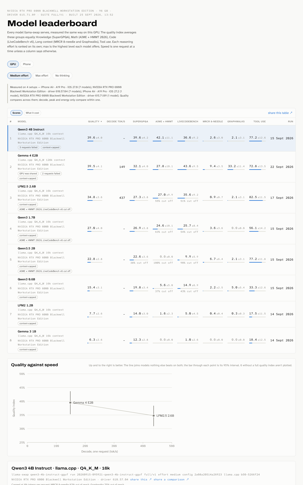
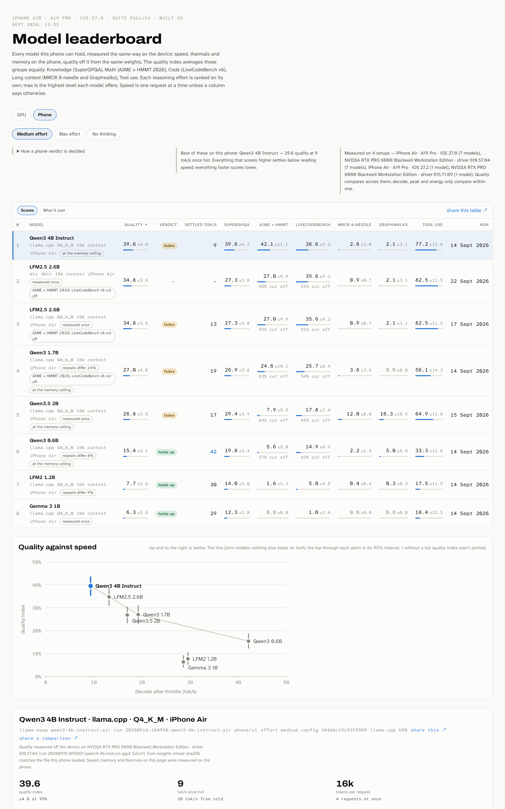

# mbench

[](https://github.com/guitaripod/mbench/actions/workflows/tests.yml)
[](https://guitaripod.github.io/mbench/)
[](https://github.com/guitaripod/mbench/releases/latest)
[](https://www.python.org/downloads/)
[](LICENSE)

Rank the models your own GPU runs. mbench measures every model [llama-swap](https://github.com/mostlygeek/llama-swap) serves — speed and answer quality — the same way each time, and builds one leaderboard page out of the results.

```
mbench run gpt-oss-120b
```

One command per model. It loads the model through llama-swap, checks the server, measures, stores everything in SQLite and rebuilds a self-contained page: quality against speed, a sortable table with 95% intervals, a detail view per model. The run lives in a systemd user unit, so closing the terminal only detaches you from it, and `mbench resume` continues from the last saved answer.

It measures the model as your server actually runs it — quantization, chat template, tool-call parser, speculative decoding, context window and all — not the weights in a vacuum.

<picture>
  <source media="(prefers-color-scheme: dark)" srcset="docs/leaderboard-dark.png">
  
</picture>

## What comes out

<!--LEADERBOARD-->
| Model | Quality | SuperGPQA | Math | LCB | MRCR | Graphwalks | Tools | tok/s | Peak | TTFT 32k | Wh/correct | Run |
|---|--:|--:|--:|--:|--:|--:|--:|--:|--:|--:|--:|--:|
| Qwen 3.8 27B · SGLang · DFlash2 · 524K | 81.0 | 61.2 | 81.0 | 76.2 | 78.4 | 94.5 | 100.0 | 157 | 400 | 5.0 | 2.67 | 12 Sep |
| Muse Glimmer 30B · SGLang · FP8 · DFlash2 · 128K | 71.6 | 57.8 | 84.1 | 62.4 | 33.9 | 78.8 | 97.4 | 143 | 680 | 4.0 | 2.73 | 13 Sep |
| GPT-OSS 120B · SGLang · MXFP4 · DFlash · 128K | 71.2 | 51.4 | 87.3 | 83.2 | 11.0 | 64.4 | 96.5 | 206 | 432 | 1.8 | 5.99 | 12 Sep |
| MiMo-V2.6 Distill Qwen 9B · llama.cpp · Q5_K_M · 262k | 50.0 | 39.7 | 41.3 | 35.6 | 34.3 | 76.2 | 78.1 | 164 | 419 | 3.8 | 17.92 | 25 Sep |

_4 models on 2 setups, suite full/v1, max effort, newest run 25 Sep 2026._

_tok/s, Peak and Wh/correct come from 2 setups — NVIDIA RTX PRO 6000 Blackwell Workstation Edition · driver 610.57.04 (3), NVIDIA RTX PRO 6000 Blackwell Workstation Edition · driver 615.71.09 (1) — and only compare within one_

### On an iPhone

| Model | Quality | SuperGPQA | Math | LCB | MRCR | Graphwalks | Tools | Settled | Cold | Holds | Peak RAM | Verdict | Run |
|---|--:|--:|--:|--:|--:|--:|--:|--:|--:|--:|--:|--:|--:|
| Qwen3 4B Instruct · llama.cpp · Q4_K_M · iPhone Air | 39.6 | 39.6 | 42.1 | 36.6 | 2.6 | 2.1 | 77.2 | 9 | 20 | 34 | 3373 | fades | 14 Sep phone |
| LFM2.5 2.6B · MLX · 4bit · iPhone Air | 34.8 | 27.3 | 27.0 | 35.6 | 0.9 | 2.1 | 82.5 | – | – | – | 2164 | – | 22 Sep phone |
| LFM2.5 2.6B · llama.cpp · Q4_K_M · iPhone Air | 34.8 | 27.3 | 27.0 | 35.6 | 0.9 | 2.1 | 82.5 | 13 | 34 | 26 | 1026 | fades | 17 Sep phone |
| Qwen3 1.7B · llama.cpp · Q4_K_M · iPhone Air | 27.0 | 26.9 | 24.6 | 25.7 | 3.6 | 0.0 | 56.1 | 19 | 47 | 25 | 3349 | fades | 14 Sep phone |
| Qwen3.5 2B · llama.cpp · Q4_K_M · iPhone Air | 26.8 | 29.4 | 7.9 | 17.8 | 12.0 | 16.3 | 64.9 | 17 | 39 | 42 | 3305 | fades | 15 Sep phone |
| Qwen3 0.6B · llama.cpp · Q4_K_M · iPhone Air | 15.4 | 19.8 | 5.6 | 14.9 | 2.2 | 5.0 | 33.3 | 42 | 122 | 27 | 3365 | holds up | 14 Sep phone |
| LFM2 1.2B · llama.cpp · Q4_K_M · iPhone Air | 7.7 | 14.0 | 1.6 | 5.0 | 0.4 | 0.3 | 17.5 | 30 | 78 | 26 | 793 | holds up | 14 Sep phone |
| Gemma 3 1B · llama.cpp · Q4_K_M · iPhone Air | 6.3 | 12.3 | 0.0 | 1.0 | 0.0 | 0.0 | 18.4 | 29 | 66 | 28 | 854 | holds up | 14 Sep phone |

_8 models on 4 setups, suite full/v1, medium effort, newest run 22 Sep 2026._

_tok/s, Peak and Wh/correct come from 4 setups — iPhone Air · A19 Pro · iOS 27.0 (7), NVIDIA RTX PRO 6000 Blackwell Workstation Edition · driver 610.57.04 (7), iPhone Air · A19 Pro · iOS 27.2 (1), NVIDIA RTX PRO 6000 Blackwell Workstation Edition · driver 615.71.09 (1) — and only compare within one_
<!--/LEADERBOARD-->

Quality is the index; then one column per task, single-request decode speed, peak throughput across all requests, first-token wait on a 32k prompt, and board watt-hours per correct answer. The [live page](https://guitaripod.github.io/mbench/) adds 95% intervals, per-length breakdowns and every server setting behind each run. Those are one GPU's numbers — yours will differ with your hardware, quantization and server settings.

## What a run measures

| Task | Full suite | Scored by |
|---|---|---|
| Speed | 3 prompts × 3 repeats at 1,024 tokens; 1 up to 32 requests at once, as many as the server takes; first-token wait and decode speed from 1k to 250k-token prompts; GPU power | greedy decoding, streamed timings, `nvidia-smi` |
| SuperGPQA | 521 graduate-level questions, ten options, spread over its 13 disciplines like the full set | final `Answer: X` line |
| AIME + HMMT 2026 | 63 problems × 2 samples, 64k-token budget | last `\boxed{{}}`, compared symbolically with [Math-Verify](https://github.com/huggingface/Math-Verify) |
| LiveCodeBench v6 | 101 problems (Jan–Apr 2025), 64k-token budget | hidden tests, run in a network-less Docker container |
| MRCR, 8 needles | 60 conversations, 15 each at 16k, 32k, 64k and 128k tokens | OpenAI's grade: the requested prefix, then the difflib ratio |
| Graphwalks | 48 graphs, BFS and parent queries from 8k to 64k tokens | F1 of the node set on the last line |
| Tool use | 38 episodes × 3 against a simulated workspace: chained calls, error recovery, clarifying questions, look-alike tools, refund policy, conditionals, follow-ups | the workspace's end state and the reply, not the exact calls |

The quality index averages five groups equally: knowledge, math, code, long context (MRCR and Graphwalks) and tool use. It appears once every task has run, and its 95% interval bootstraps the questions of every task. Each reasoning effort is ranked on its own, so a model's max-effort run sits beside its everyday medium one, and `--effort none` ranks a model with thinking switched off. `--quick` (45–90 minutes, ranked as provisional) and `--smoke` (a pipeline check, never ranked) run smaller samples.

### Why these tasks

MMLU-Pro, AIME 2025, plain needle-in-a-haystack and single-turn tool calls are the usual picks, and current open models sit within a few points of each other on the first and near 100% on the last two — they no longer separate anything. So: SuperGPQA is harder and much larger, the 2026 competitions postdate most of today's models, MRCR and Graphwalks are the long-context tests the model makers themselves report, and the tool episodes follow the [2026 validity audit of tool-calling benchmarks](https://arxiv.org/abs/2607.02577) — deterministic checks of what the model did to the world, so a different valid route to the same result still passes.

LiveCodeBench has published nothing newer than April 2025, so models trained after mid-2025 may have seen its problems; read that column as an upper bound. `mbench sources` checks Hugging Face for newer releases and for pinned files that moved.

## Numbers you can trust

- **Fixed inputs.** Datasets are downloaded once and pinned by sha256, question subsets use fixed seeds, and every run records the harness version, the suite version and a fingerprint of the llama-swap command plus the launcher script it calls — edit a launcher and it counts as a new configuration.
- **Fixed conditions.** Speed decodes greedily, so the same prompt yields the same tokens and drafter acceptance stays comparable. Quality uses each model's recommended sampling, because reasoning models degrade at temperature 0. A run waits for other GPU work to finish, and says so on the board if it had to go ahead anyway.
- **One stack per speed number.** Every run records the card, its driver and the build of the server that answered — SGLang's version or the commit of the checkout it runs from, llama.cpp's build string. Quality compares across those; decode, peak and watt-hours only compare within one, so the board says when a ranking spans two setups, and `mbench doctor` says when the stack moved under a model since its last run.
- **Intervals, not point scores.** Every task carries a 95% interval (Wilson, or the spread of per-question means), and the index bootstraps questions within each task. `mbench compare` pairs two runs question by question and says which differences survive the noise.
- **A dead server is not a bad score.** When the model server stops answering — it crashed, or the card fell off the bus — the run stops and says so, with the kernel's Xid line if there is one, instead of recording the silence as wrong answers. The card is watched the whole way through, and a run keeps its answers so it continues once the machine is well again.
- **Nothing quietly skipped.** A prompt that doesn't fit the model's context scores zero instead of disappearing, and the board says which task that cost. When the server refuses a request for its length, mbench reads the window and prompt size out of the refusal, retries once with a smaller answer budget, then scores zero.
- **Cost as well as speed.** Board energy is integrated across the quality tasks and divided by correct answers, so a fast-but-wasteful model is visible as watt-hours per correct answer.
- **Saturation is flagged.** With three or more models ranked, the board marks any task that isn't separating them — all near the ceiling, all near the floor, or apart by less than the noise.

## Benchmarking a model

You need Linux with systemd user units and an NVIDIA GPU, llama-swap in front of SGLang or llama.cpp, Docker for grading LiveCodeBench, Python 3.12 with [uv](https://docs.astral.sh/uv/), and about 1 GB of disk for the pinned datasets. vLLM speaks the same API but is untested: it doesn't report how many requests it takes at once, so mbench sends 4.

```
uv tool install git+https://github.com/guitaripod/mbench
```

**1. Describe the model.** mbench reads its launch command from llama-swap's config; anything that command doesn't say goes in `~/.config/mbench/models.toml`, keyed by llama-swap model id. `mbench profile <id>` shows what was resolved and where each value came from.

```toml
[gpt-oss-120b]
thinking = "openai"
efforts = ["low", "medium", "high"]
context = 131072
hf_id = "openai/gpt-oss-120b"
quantization = "MXFP4"
spec = { method = "EAGLE3", draft = "lmsys/EAGLE3-gpt-oss-120b-bf16", tokens_per_step = 3 }
```

- `thinking` is how the model takes a reasoning level: `openai` sends `reasoning_effort`, `qwen` sends `chat_template_kwargs` with `enable_thinking` and `reasoning_effort`, `muse` sends `chat_template_kwargs` with `reasoning_strength`, `none` sends nothing.
- `efforts` lists the levels the chat template accepts, lowest first; `--effort max`/`min` pick the ends.
- `context` caps the long-prompt tests. Without it, mbench asks the server once the model is loaded.
- `hf_id`, `quantization`, `spec` and `engine` only matter for `--submit`.
- [Oh My Pi](https://github.com/can1357/oh-my-pi) users: `compat.thinkingFormat`, `thinking.efforts` and `contextWindow` are read from its `models.yml` too; `models.toml` wins.

**2. Check the server.** `mbench doctor <id>` loads the model and verifies tokens per request, how many questions the server lets run at a time, reasoning kept apart from the answer, structured tool calls, a conversation carrying a tool result, and a 16k-token prompt. That number sets how long a run takes: with `--kv-unified`, llama.cpp's `--ctx-size` is one pool every slot shares, and a pool too small for two answers side by side runs every question alone.

**3. Run it.** `mbench run <id> --effort max`, or `mbench run <a> <b> --at 02:00 --until 09:00` for a nightly window. Extra models queue and run one at a time. Answers are written as they arrive, so a pause costs nothing, and the local page rebuilds when the run ends.

**4. Read it.** `mbench ls --effort max` in the terminal, `mbench board --open` for the page, `mbench compare <a> <b>` when two models look close and you want to know whether the gap is real. The table shows the scores or what running them cost, whichever tab you pick, and every one of its links opens a 1200 × 675 card that downloads as a PNG for posting: *share this table ↗* ranks everything in the tab, *share this ↗* profiles one model — its per-question scores, and for a phone the throughput curve across twenty answers — and *share a comparison ↗* sets two models against each other with ties greyed out.

**5. Publish it.** `scripts/publish.sh max` exports `site/index.html` and `site/board.json`, re-renders both screenshots, and rewrites the table above between its markers. Commit and push: the `pages` workflow redeploys the site on any change under `site/`. The database is the record; the page, the JSON and that table are all projections of it, so nothing is typed by hand.

A model only joins an existing ranking if it ran at the same effort level, and changing the question set means bumping the suite version so old and new runs are ranked apart rather than mixed.

### Every command

```
mbench run <id>                       full suite at medium effort
mbench run <id> --effort max          the model's highest declared effort, ranked separately
mbench run <id> --quick --detach      smaller samples; start and return at once
mbench run <id> --only speed          one task; --skip leaves tasks out
mbench run <id> --reuse               carry over answers that still apply
mbench run <id> --quality-from <run>  for a phone run: whose quality the board shows
mbench run <a> <b> --at 03:00 --until 08:00
                                      several models, one after another, only at night
mbench run <id> --submit              also submit to localmaxxing (all, speed or evals)
mbench status                         what is running, how long its task has left, what is scheduled
mbench wait [<run>]                   block until a run finishes, however often it gives way
mbench logs -f                        follow the worker log
mbench cancel / mbench resume         stop a run; continue it later
mbench ls [--effort max] [--device phone] [--markdown]
                                      ranked table in the terminal, one tier at a time
mbench compare <a> <b>                paired differences, task by task, with 95% intervals
mbench doctor <id>                    check a model's server before spending a night on it
mbench sources                        newer question sets, or pinned files that moved
mbench board --open                   the leaderboard page
mbench export --out site              the page plus board.json, ready to publish
mbench profile <id>                   what mbench knows about a model
mbench rescore [<run>]                score a finished run again from the answers it kept
mbench rm <run|model> [--dry-run]     forget runs and everything they measured
mbench phone [health|installed|launch|forward|push|logs]
                                      the phone mbench runs on
```

`mbench -h` and `mbench run -h` cover every option.

## Benchmarking a phone

The same llama.cpp that serves your card also runs on an iPhone, so a phone is measured on the same terms as the desktop. The question it answers is not which model is cleverest but **which one the device can live with**: a model that makes the phone dim its screen is disqualified however well it scores.



```
ios/mbenchd/scripts/build-llama.sh     cross-compile llama.cpp for arm64 iOS
ios/mbenchd/scripts/install.sh         build, sign and install it, then check the phone agrees
mbench phone installed                 which build the device is actually holding
mbench phone launch                    start it on the device
mbench phone push model.gguf           copy the weights over the cable
mbench phone forward                   llama-server on 18080, mbenchd on 18081
mbench run <id> --quality-from <run>   measure the phone
```

<details>
<summary><b>How a phone runs the suite</b> — one app, two ports, no Mac</summary>

`ios/mbenchd` is llama.cpp's own `llama-server`, cross-compiled for arm64 iOS from Linux and run inside an app. No Mac and no Xcode: `GGML_METAL_EMBED_LIBRARY` ships the Metal kernels as *source*, so the phone compiles them itself at first load and the build needs nothing but clang and the iPhoneOS sysroot xtool already carries. The app and the desktop therefore run the same commit, which is what makes their numbers comparable at all.

| Port | What answers |
|---|---|
| 8080 | `llama-server` itself, unproxied — mbench measures straight against it, so no timing passes through code of ours |
| 8081 | mbenchd: `/mb/health`, `/mb/models`, `/mb/load`, `/mb/unload`, and llama-swap's `/running` and `/unload` |

mbench reaches both over the cable (`pymobiledevice3 usbmux forward`), loads the model by POSTing the `phone` table to `/mb/load`, and then talks plain OpenAI to the phone as if it were any other server. In place of the driver's power and VRAM, it polls `/mb/health` once a second for thermal state, the memory the process holds and the battery, so every speed row carries the conditions it was measured under. If the app stops answering — backgrounded, jetsammed, cable out — the run stops and says so rather than scoring the silence.

The app must stay in the foreground with the screen on; iOS suspends a backgrounded app and its sockets go with it. `xtool launch` cannot start it on iOS 17+, so `mbench phone launch` uses DVT process control instead.

</details>

<details>
<summary><b>What a phone run measures</b> — and what it refuses to</summary>

- **Tokens at full speed.** Twenty answers a second apart, the protocol the published sustained-load measurements of phone inference use, from a device that has held its cold thermal state for a minute first. The board reports the cold speed, the speed it settles at, how many tokens it delivered before throughput fell under 90% of cold, and **stability** — the slowest answer over the fastest, the same ratio a GPU stress test reports, where 97% is the bar a device that is not throttling clears. A card scores 99; a phone does not.
- **Where the context wall is.** The memory the app actually held, beside the context it managed to load. A model that loads at 16k and refuses at 64k says so.
- **A verdict, not a ranking.** *holds up* keeps four fifths of its cold speed and delivers 2k tokens before giving any of it up; *fades* loses a fifth or slows sooner; *barely runs* is under 8 tok/s once settled, under half its cold speed, or slowing inside 512 tokens. The last is a failure, not a low score.
- **Thermal state and battery, as context only.** Both are recorded and shown, and neither decides anything: a charger, a warm room or a different handset moves them, and none of those move what the model delivered. A run made off the charger extrapolates its discharge to a full charge the way a phone battery test does, and reads as hours of continuous generation; a charging run reports nothing rather than pretending the drain was zero.
- **The same file, proved twice.** Both sides hash the weights they served, and a phone row inherits quality only from a run whose sha256 matches. Each run also keeps a greedy answer to one fixed question, so the board can say how far the two agreed before diverging — which catches a different chat template or a different quantisation path that a matching hash cannot.
- **Quality, measured off the device and never made easier.** A 4B model answering a 64k-token reasoning budget at phone speed takes days, so quality comes from a desktop run of *the same .gguf*, named with `--quality-from`. The phone suite measures speed and nothing else — there is no reduced question set a small model could be scored against, and the linked run has to be a full or quick one. A 0.6B answers the same SuperGPQA questions and the same 128k MRCR conversations as a 120B, and takes the zeros its context earns.

Phone rows sit on their own tab, ranked against each other and never mixed with the card's — the quality index compares across stacks, tokens per second never do.

</details>

<details>
<summary><b>Declaring a phone model</b> — a <code>phone</code> table instead of a llama-swap command</summary>

A phone model has no llama-swap entry, so `models.toml` says everything. What the `phone` table says is the load request mbenchd sends, so changing the context or the KV type counts as a new configuration, the same way editing a launcher script does. `file` names the `.gguf` on the device when it differs from the model id; ids containing a dot need quoting.

```toml
["qwen3-1.7b-air"]
name = "Qwen3 1.7B · llama.cpp · Q4_K_M · iPhone Air"
hf_id = "unsloth/Qwen3-1.7B-GGUF"
quantization = "Q4_K_M"
thinking = "qwen"
efforts = ["none", "medium"]
phone = { file = "Qwen3-1.7B-Q4_K_M.gguf", n_ctx = 16384, parallel = 4, flash_attn = "on", cache_type_k = "q8_0", cache_type_v = "q8_0", extra_args = ["-kvu"] }
```

`control_url` and `server_url` in the same table point mbench at a phone that is not on this cable.

</details>

## Runs that fit around you

A full run takes hours, so it stays out of the way:

- **`--at 03:00 --until 08:00`** runs models one after another inside a nightly window. Whatever is unfinished at 08:00 stops, llama-swap unloads the model, and the run continues from its saved answers the next night. Near the end of a window a run stops taking questions that couldn't finish in time.
- **Runs give way.** When a game or another GPU job holds the card for a minute, the run unloads the model, pauses and retries every ten minutes, whether it was scheduled or started by hand. `--keep-gpu` turns that off.
- **Every run starts with the doctor checks**, so a misconfigured server fails in the first minute instead of producing a night of zeros.
- **The request count matches the server.** mbench reads how many requests it accepts at once and how much context they share, then sends many short questions in parallel and long conversations one at a time.
- **`--reuse`** starts a fresh run that keeps the answers of an earlier one for every task whose questions and scoring didn't change, and measures only the rest.
- **Notifications.** Finishing, failing or pausing sends a desktop notification; set `notify` in `~/.config/mbench/config.toml` (or `MBENCH_NOTIFY`) to forward it anywhere, e.g. `notify = 'curl -d "$MBENCH_MESSAGE" https://ntfy.sh/your-topic'`.

## localmaxxing

`--submit speed` has lmx measure its two canonical prompts, then submits the runs through the [localmaxxing](https://www.localmaxxing.com) API with the prompt hash, output sample and timings the lmx client leaves out, so they earn the Verified badge. `--submit evals` answers the GSM8K and HellaSwag shards the site doesn't have yet for that model and quantization. `--submit` alone does both. Needs `hf_id` and `quantization` in `models.toml`, and [lmx](https://github.com/LottoLottoLotto/localmaxxing-cli) logged in.

## Files

- `~/.local/share/mbench/bench.db`: runs, metrics and submissions
- `~/.local/share/mbench/runs/<run>/`: every answer as JSONL (tool episodes with their calls and results), speed samples, the doctor report, server settings, the worker log
- `~/.local/share/mbench/leaderboard.html`: rebuilt after every run
- `~/.config/mbench/models.toml`: model facts · `config.toml`: the notify command
- `~/.cache/mbench/`: pinned datasets, their token counts and the LiveCodeBench harness

Environment overrides: `MBENCH_HOME`, `MBENCH_SWAP_URL` (default `http://127.0.0.1:8081`), `MBENCH_SWAP_CONFIG`, `MBENCH_OMP_MODELS`, `MBENCH_NOTIFY`, `XDG_CONFIG_HOME`, `XDG_CACHE_HOME`.

## Credits

Questions come from [SuperGPQA](https://huggingface.co/datasets/m-a-p/SuperGPQA) (ODC-BY), [MathArena's AIME 2026 and HMMT February 2026](https://matharena.ai) (CC BY-NC-SA 4.0), [LiveCodeBench](https://livecodebench.github.io), and OpenAI's [MRCR](https://huggingface.co/datasets/openai/mrcr) and [Graphwalks](https://huggingface.co/datasets/openai/graphwalks) (MIT) — downloaded at run time, never redistributed. Code grading uses LiveCodeBench's own harness at a pinned commit. The long speed prompts are built from MMLU-Pro question text; the two canonical speed prompts are localmaxxing's.

## Development

```
uv run --group dev pytest
uv tool install --editable .
scripts/publish.sh max         # site/, docs/*.png and the table above
```

Licensed under GPL-3.0-or-later.
